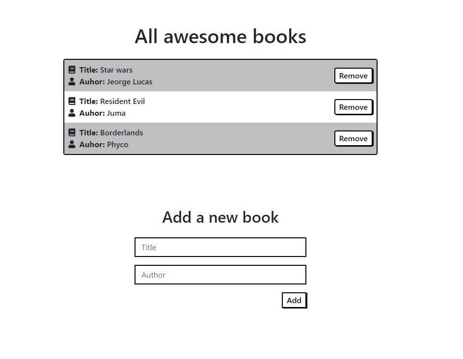

# Awesome Books

> Awesome Books acts as a CRUD library where you can store books and display them on a list using objects and arrays. The data persists thanks to localStorage functions.

## Image Preview

## :star::star: [Live Demo](https://mrigorir.github.io/awesome_books/) :star::star:

## What was built in this project:

- Plain HTML page to display stored books from localStorage.

- An array of objects where the books are stored.

- An add button to add books to the collection and localStorage.

- A Remove button to delete a book from the storage and page.

- Create a localStorage to make data persist on the browser.

- Use Classes, constructors,s, and methods to get an organized, clean, and better-performance code.

- Use bootstrap and CSS to style the HTML.

## Built With

- Javascript

- Bootstrap

- CSS

- HTML

-Local Storage

- VS code

- Eslint

- Stylelint

## Prerequisites

Text Editor (VSCode is suggested).

## Getting Started

To get a local copy up and running follow these simple example steps:

- On the project, GitHub page, navigate to the [main page of the repository](https://github.com/mrigorir/awesome_books/)

- Click on a button named `Code`

- Copy the project URL as displayed on HTTPS tab

- If you're running Windows Operating System, open your command prompt. On Linux, Open your terminal

- Change the current working directory to the location where you want the cloned directory to be made. Leave as it is if the current location is where you want the project to be.

- Type `git clone`, and then paste the URL you copied in Step 3. 

  `$ git clone https://github.com/mrigorir/awesome_books.git` <em>Press Enter key</em> 

- Your local copy will be created.

- Please note that you must have Git installed on your PC, this can be done [here](https://gist.github.com/derhuerst/1b15ff4652a867391f03)

- After you get the project aiming to the desired directory, you need now to install ruby globally and follow the steps below:

### Github Actions

To make sure the linters' checks using Github Actions work properly, you should follow the next steps:

1. On your recently forked repo, enable the GitHub Actions in the Actions tab.
2. Create the `feature/branch` and push.
3. Start working on your milestone as usual.
4. Open a PR from the `feature/branch` when your work is done.

### Usage

- Open the HTML file on the browser.

- Press f12 OR right-click and then inspect OR `ctrl`+`alt`+`i` if you are on windows to access developer tools.

- Once you are on developer tools you can check on console tab for debugging the code OR you can check Application tab to watch Local Storage behavior.

## Authors

👤 **Marco Parra**

- GitHub: [@mrigorir](https://github.com/mrigorir)
- Twitter: [@marcoparra311](https://twitter.com/marcoparra311)
- LinkedIn: [@marco-alonso-parra](https://www.linkedin.com/in/marco-alonso-parra/)

👤 **Guilherme Giachellin**

- GitHub: [@guilherme](https://github.com/GuilhermeGiachellin)
- LinkedIn: [@guilherme-giachellin-2599771b9](https://www.linkedin.com/in/guilherme-giachellin-2599771b9/)

## 🤝 Contributing

Contributions, issues, and feature requests are welcome!

Feel free to check the [issues page](https://github.com/mrigorir/awesome_books/issues).

## Show your support

Give a ⭐️ if you like this project!

## Acknowledgments

- Microverse Activities

## 📝 License

This project is [MIT](https://github.com/mrigorir/awesome_books/blob/main/LICENSE) licensed.

